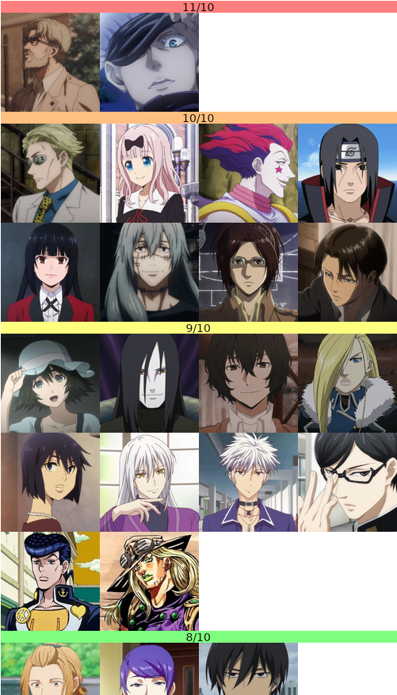
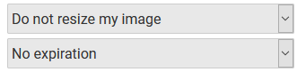

# MAL Favorites BBCode Generator

<p align="center">
  
</p>

This script generates BBCode for a tier list with images of your favorite characters.
The resulting images contain links to the respective characters' MAL pages.

There are 7 tiers by default.
The script is very short and simple, so you can modify it to your liking.


## Prequisites
* Python 3
* GIMP

## How to use

### Download repository
This can be done manually through GitHub's UI, or with `git clone`.

### Prepare the images
Unfortunately, the script doesn't resize or deal with hosting the images.

#### Image size
The images need to be properly formatted before they are used.
For this, I recommend using GIMP.
Rrecommendations for the formatting of the images:

* All header images should be be the same size, e.g. 1000x30
* All character images should be the same size, e.g. 250x250
* The width of the header should be divisible by the width of the character, e.g. if the banner width is 1000, then the suggested character width would be 250, 200, etc. so that it tiles nicely

In the `img` folder I provided some blank header images for all tiers.
You can create your own by importing the `mal_tiers_slim.xcf` file into GIMP and adding text, etc.

#### Image hosting
To host the images I use https://postimages.org/.
Remember to use **direct links** to the images.
They should end with the original file's extension, e.g. `.png`.
Otherwise they will get resized and things will break.
Recommended settings when uploading:

<p align="center">
  
</p>

### Fill out the `*_tier.txt` files

By default, the script is expecting files named `S_tier.txt`, `A_tier.txt`, `B_tier.txt`, ... , `F_tier.txt`.
These are the files where the links to images and MAL pages should be placed.

The `*_tier.txt` files should follow this pattern:

Line | Description |
--- | --- |
1 | direct link to header image for the tier |
2 - *n* | direct link to character image and link to character's MAL page, in CSV format |

Example `S_tier.txt`:

```
https://i.postimg.cc/2SpmrDht/S-tier-numbered.png
https://i.postimg.cc/1X0SjyJm/zeke.png,https://myanimelist.net/character/142314/Zeke
https://i.postimg.cc/hj96KMr8/gojo-eye.png,https://myanimelist.net/character/164471/Satoru_Gojou
```

### Run the script

Run the following command from the terminal:

```
python favgen.py
```

This should generate a file `favbbcode.txt`.
It contains the generated BBCode.

### Using the generated BBCode
Paste the BBCode into a blog post on MAL.
